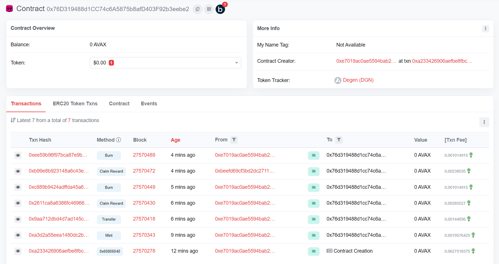

#Degen Token (ERC-20): Unlocking the Future of Gaming

This Contract Creates ERC-20 Fungible tokens that can be transfered,minted and used to redeem rewards.

## Description

This Contract is deployed on the FUJI testnet and is used to create fungible tokens that can be used to redeem rewards. The contract makes use of the ERC-20 standard and is deployed on the Fuji network.
Provides the following functionality:

- Minting of tokens
- Transfer of tokens
- Redeeming of tokens
- Burning of tokens
- Checking of balances

## Getting Started

### Executing program

Executing program To run this program, you can use Remix, an online Solidity IDE. To get started, go to the Remix website at https://remix.ethereum.org/.

Once you are on the Remix website, create a new file by clicking on the "+" icon in the left-hand sidebar. Save the file with a .sol extension (e.g., HelloWorld.sol). Copy and paste the following code into the file:

```javascript
// SPDX-License-Identifier: UNLICENSED
// SPDX-License-Identifier: MIT
pragma solidity ^0.8.18;

import "@openzeppelin/contracts/token/ERC20/ERC20.sol";
import "@openzeppelin/contracts/access/Ownable.sol";

contract DegenToken is ERC20, Ownable {
    struct Reward {
        string name;
        uint256 cost;
    }
    Reward[] public rewards; // List of available rewards
    mapping(address => mapping(uint256 => bool)) public claimedRewards;
    constructor() ERC20("Degen", "DGN") {
        rewards.push(Reward("Official Degen NFT - ", 50));
        rewards.push(Reward("Merchandise - ", 100));
        rewards.push(Reward("Credits -", 100));
    }
    function getTotalRewards() public view returns (uint256) {
        return rewards.length;
    }

    function decimals() public pure override returns(uint8){
        return 0;
    }

    function claimReward(uint256 rewardIndex) public {
        require(rewardIndex < rewards.length, "Reward index out of bounds");
        require(!claimedRewards[msg.sender][rewardIndex], "Reward already claimed");
        require(balanceOf(msg.sender) >= rewards[rewardIndex].cost, "Insufficient tokens");
        _approve(msg.sender,address(this),rewards[rewardIndex].cost);
        transfer(address(this), rewards[rewardIndex].cost);
        claimedRewards[msg.sender][rewardIndex] = true;
    }

    function mint(address to, uint256 amount) public onlyOwner {
        _mint(to, amount);
    }
    function transfer(address to,uint amount) public override returns(bool){
        require(amount <= balanceOf(msg.sender), "ERC20: transfer amount exceeds balance");
        _transfer(msg.sender, to, amount);
        return false;
    }

    function shop() public view returns(Reward[] memory) {
        return rewards;

    }


    function burn(address from, uint256 amount) public onlyOwner {
        _burn(from, amount);
    }
}
```

To compile the code, click on the "Solidity Compiler" tab in the left-hand sidebar. Make sure the "Compiler" option is set to "0.8.9" (or another compatible version), and then click on the "Compile HelloWorld.sol" button.

Once the code is compiled, you can deploy the contract by clicking on the "Deploy & Run Transactions" tab in the left-hand sidebar. Select the "DegenToken" contract from the dropdown menu, and then click on the "Deploy" button.

Once the contract is deployed, you can interact with it by calling the sayHello function. Click on the "DegenToken" contract in the left-hand sidebar, and then click on multiple functions available. Finally, click on the "transact" button to execute the function and retrieve the appropriate messages.

## Proof of work as the Fuji Contract detail

### Contract Address is provided as Application id as well



## Authors

Priyanshu Dwivedi
[@BuilderPrid](https://github.com/BuilderPrid)

## License

This project is licensed under the MIT License - see the LICENSE.md file for details
